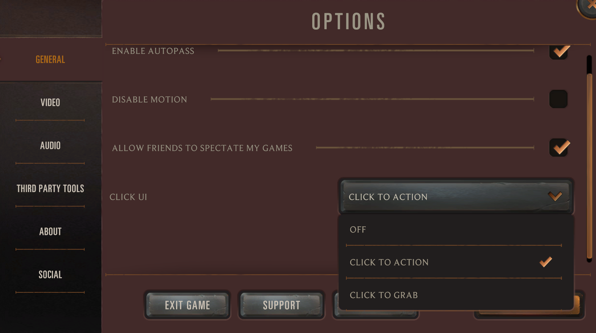
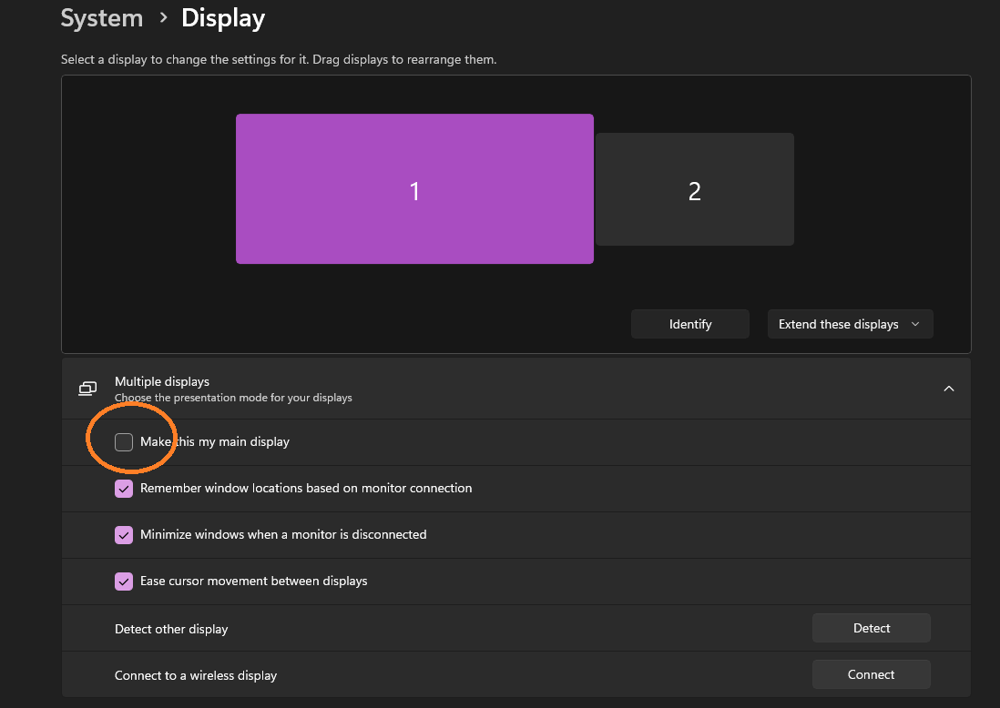

# autoruneterra

Educational data collection tool for clicker game automation research.

## Setup

PyTorch is required but not included in `requirements.txt` since installation varies by system. Install it first by following the [official guide](https://pytorch.org/get-started/locally/), then run:

```
pip install -r requirements.txt
```

### LoR client API

The data collector and player both call the LoR client's positional-rectangles endpoint at `http://localhost:21337/positional-rectangles` to read the live card state. This endpoint must be reachable (LoR running with the API enabled) — if it's down, capture and inference cycles abort instead of saving stale data.

### `setlite.json`

`setlite.json` at the repo root is a merged card-metadata dictionary keyed by `cardCode`. It's committed, so you don't need to build it — only regenerate when Riot ships a new set. The runtime reads `cost`, `attack`, and `type` from it to turn the API's card list into model features.

### `config.json`

```json
{
    "shortcuts": { "capture_key": "shift", "virtual_click_key": "z", "debug_virtual_click_key": "x" },
    "game_window": { "title": "Legends of Runeterra", "x": 0, "y": 0, "width": 1920, "height": 1080 },
    "model_name": "darius",
    "output_folder": "darius_dataset",
    "output_resolution": { "width": 200, "height": 500 },
    "crop_box": { "left": 1564, "top": 290, "right": 1764, "bottom": 796 }
}
```

- `crop_box` — region of the captured screenshot that gets saved (and that the model sees at inference). Pick a sub-region that contains the visual signal you care about.
- `output_resolution` — final size everything gets resized to after cropping. Drives both the saved PNG dimensions and the model's input size.
- `model_name` — weights are written to `{model_name}.pt` (coord regressor) and `mode_{model_name}.pt` (mode classifier).

## Game Settings

Before using the tool, set **Click UI** to **Click to Action** in the game's Options menu under General:



## Collecting Data

1. Make sure LoR is running and the API is reachable, then run `python datacollector.py`.
2. Press the capture key (default: `shift`). This moves the cursor out of the way, screenshots the game window, and fetches the current card list from the LoR API. Both are held in memory. If the API call fails the capture is cancelled.
3. Move the cursor to the point you want to label.
4. Press the virtual click key (default: `z`) to save the labeled sample. You can press `z` multiple times against the same capture to label several points — press `shift` again to refresh the capture.
5. Press `esc` to quit.

Each save produces a **pair** in `output_folder/`:

- `{timestamp}_{x}_{y}.png` — the screenshot cropped to `crop_box` and resized to `output_resolution`. `x` and `y` are the cursor's position in the *game window* normalized to 0–100.
- `{timestamp}_{x}_{y}.json` — an array of `{cardCode, cost, attack, type}` for every card the API saw at capture time. Cards whose `cardCode` isn't in `setlite.json` (e.g. `"face"`) are skipped.

### Debug clicks

`debug_virtual_click_key` (default: `x`) prints the cursor's normalized coords without saving anything. Useful for measuring hitboxes.

## Training

The project trains two ResNet-18 fine-tunes that work together:

- **Coord regressor** (`{model_name}.pt`) — predicts the normalized click target `(x, y)` from a screenshot, conditioned on the action mode. Trained by `trainer.py`.
- **Mode classifier** (`mode_{model_name}.pt`) — predicts which action mode the screen is asking for. Trained by `modetrainer.py`.

```
python trainer.py        # -> {model_name}.pt
python modetrainer.py    # -> mode_{model_name}.pt
```

Both read `model_name` from `config.json` (e.g. `darius` → `darius.pt`, `mode_darius.pt`).

Both models consume the same three inputs — the cropped screenshot, the sidecar card list, and the player's current mana — plus, for the regressor, the predicted mode:

- The ResNet-18 backbone turns the image into a 512-dim feature.
- A small per-card MLP embeds each card's `[cost/20, attack/30, is_unit]` (where `is_unit` is `1` if `type == "Unit"`, else `0`); a masked sum across cards produces a fixed-size 16-dim "card-set" feature. This is permutation-invariant and handles variable card counts without padding to a fixed length.
- The current mana value is read off the screenshot with EasyOCR (see `get_manastone.py`) and passed in as a normalized scalar (`mana / 10`). Without this, the model can see each card's cost but has no signal for which ones are actually playable.
- The **mode classifier** head sees `[image_feat, card_feat, mana]`.
- The **coord regressor** head sees `[image_feat, card_feat, mana, mode_onehot]` and outputs `(x, y)`.

At inference the mode classifier runs first and its prediction is fed into the regressor, so the coord head focuses on the right region of the screen.

### Action modes

Mode labels are derived from the click coords in the filename via `coord_to_mode.py`. Each mode corresponds to a screen region:

- `confirmation` — diamond-shaped hitbox around the confirm button.
- `prepare_summon` — bottom band (`y > 91`).
- `prepare_battle` — mid band (`78 ≤ y ≤ 88`).
- `unknown` — anything else.

To add a new mode, **append** a new branch/region to `coord_to_mode.py` and add the label to the end of `MODES`. Never insert in the middle — class indices would shift and existing checkpoints would silently change meaning. Adding a mode changes the head size, so retrain both models afterwards.

### Cleaning the dataset

`unknown` samples are noise for the regressor (no consistent visual signature) and inflate accuracy for the classifier without teaching it anything useful. Move them out of training with:

```
python remove_unknown.py
```

This relocates them to `.unknown/` so they're out of `click_dataset_folder/` but not lost.

## Running

Once both models are trained, `player.py` drives the game:

```
python player.py
```

Press `shift` to toggle the loop on/off, `esc` to quit. Each cycle the player:

1. Moves the cursor out of the way to clear hover effects.
2. Fetches the live card list from the LoR API. If the API is down, the cycle is skipped.
3. Screenshots the game, crops to `crop_box`, resizes to `output_resolution`.
4. Runs the mode classifier, then the coord regressor (conditioned on the predicted mode).
5. Moves the cursor to the predicted point and clicks.

## Known Issues

- **Game must run on the primary monitor.** `PIL.ImageGrab.grab()` defaults to the primary monitor's coordinate space, so a window on a secondary monitor captures as a black image. Either move LoR to the primary display, or change the call in `capture_game_screenshot` to `ImageGrab.grab(bbox, all_screens=True)`.

  To switch primary displays on Windows, open **System → Display**, select the monitor you want as primary, and check **Make this my main display**:

  
